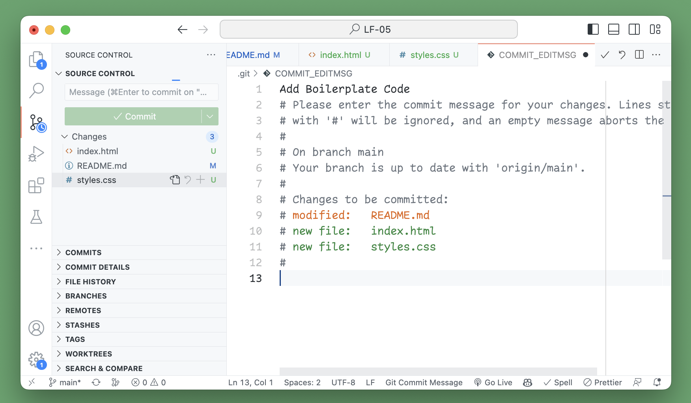

# Vor dem Commit

- `git pull`
- prettier benutzen
- `git add .`
- `git commit -m "commit message"`
- `git push origin main`

# Installation und Konfiguration von GitHub und VS Code

## Was ist GitHub überhaupt?

Git ist ein weit verbreitetes Open-Source-Tool zur verteilten Versionskontrolle von Software. Es wird sowohl in Unternehmen als auch von privaten Entwicklern weltweit genutzt und funktioniert zusammen mit verschiedensten Plattformen und IDEs.

## Vorraussetzungen

- GitHub Account
- VS Code
- Der Inhaber hat euch die Berechtigung gegeben
- Port 22 funktioniert (tut er nicht in unser Schule)

## Repository clonen

- Suche auf der GitHub Seite die Möglichkeit den Code zu clonen. Wähle dann HTTPS aus und kopiere dir den Link.
  

- Öffne nun VS Code und drück `SHIFT + CMD + P` (unter Widows `CTRL + SHIFT + P`) um die Command Palette zu öffnen. Gib dort `git clone` ein und drücke `ENTER`.
  

- Füge nun den Link ein und drücke `ENTER`.
  

- Nun sollte sich ein neuen Ordner öffnen. Dieser enthält nun den Code des Repositories.
  

- Jetzt wirst du dazu aufgefordert, dich bei GitHub anzumelden. Drücke dazu auf `Allow`.
  

- Wenn du im Webbrowser eingeloggt bist, kannst du nun auf `Authorize Visual Studio Code` klicken.
  

- Der Browser sollte jetzt ein Popup öffnen, welches dich fragt, ob du einen Link in VS Code öffnen möchtest. Drücke auf `Open Link`.
  

- Wieder in VS Code, wirst du gefragt, ob du den Link öffnen möchtest. Drücke auf `Open`.
  

- Im letzen Schritt musst du nur noch bestätigen, ob du das repository öffnen möchtest. Drücke auf `Open`.
  

- Jetzt hast du das Repository erfolgreich geclont und kannst mit der Arbeit beginnen.
  

<hr>

## Was ist Prettier?

Prettier ist ein Code Formatter, der den Code automatisch formatiert. Das heißt, dass er den Code so formatiert, dass er für jeden Entwickler gleich aussieht. Das macht es einfacher, den Code zu lesen und zu verstehen.

<hr>

## Prettier installieren

- Auf der linken Seite von VS Code, findest du das `Extensions`-Tab. Klicke darauf. Suche dort nach `Prettier - Code formatter` und installiere es.
  

- Nun musst du die Einstellungen öffnen. Drücke dazu auf das Zahnrad unten links. und wähle `Settings`.
  

- Suche nach `Format On Save` und aktiviere es.
  

- Nun wird der Code automatisch formatiert, wenn du ihn speicherst. Dazu musst du aber für jeden Dateityp den richtigen Formatter auswählen. Gehe dazu in ein HTML-File und drücke `SHIFT + CMD + P` (unter Widows `CTRL + SHIFT + P`) um die Command Palette zu öffnen. Gib dort `Format Document` ein und drücke `ENTER`.
  

- VS Code sollte nun ein Popup öffnen, drücke hier auf `Configure...`.
  

- Wähle nun `Prettier - Code Formatter` aus und drücke auf `ENTER`.
  

- Gehe jetzt in ein CSS-File und wiederhole die Schritte. Drücke `SHIFT + CMD + P` (unter Widows `CTRL + SHIFT + P`) um die Command Palette zu öffnen. Gib dort `Format Document` ein und drücke `ENTER`.
  

- Drücke in dem Popup auf `Configure...`.
  

- Wähle nun `Prettier - Code Formatter` aus und drücke auf `ENTER`.
  

- Nun sollte der Code automatisch formatiert werden, wenn du ihn speicherst.

<hr>

## Code hochladen / git commit und push

- Drücke in der Seitenleiste auf das `Source Control`-Tab und dann auf Commit.
  

- Hier wirst du gefragt, ob du die Änderungen zum Commit hinzufügen möchtest. Drücker auf `Allways`.
  

- Nun kannst du eine Nachricht eingeben, die beschreibt, was du geändert hast. Speichere die Datei dann und schließe sie. Lässt du die Datei leer, wird der Commit abgebrochen.
  

- Jetzt ist hast du einen neuen Commit erstellt. Drücke jetzt auf `Sync Changes`.
  

- VS Code fragt dich jetzt ob du womögliche Änderungen herunterladen möchtest und die Änderungen hochladen möchtest. Drücke auf `OK` oder `OK, Don't Show Again`.
  

- Unten rechts sollte nun ein Popup erscheinen, welches dich fragt ob du regelmäßig den Befehl `git fetch` ausführen möchtest. Drücke auf `No`.
  

- Nun sollte der Code hochgeladen sein. Gehe dazu auf die GitHub Seite und überprüfe, ob die Änderungen angekommen sind. Um weniger "Merg Conflicts" zu bekommen, solltest du immer nach kleineren Änderungen "pushen".

<hr>

## "Merge Conflicts" beheben

- Ein "Merge Conflict" tritt auf, wenn zwei Entwickler an einem Projekt arbeiten und beide an der selben Stelle etwas ändern. Wenn nun einer der Entwickler seine Änderungen hochlädt, wird der andere Entwickler einen "Merge Conflict" bekommen. Dieser muss dann manuell behoben werden.

- Angenommen du hast gerade die Zeile 5 und 6 verändert und möchtest dein Änderungen hochladen (pushen). In der Zwischenzeit hat ein anderer Entwickler auch an der README.md gearbeitet und seine Änderungen hochgeladen. Nun bekommst du einen "Merge Conflict".

- Drücke auf `Commit & Sync` in the drop down menu. Das solltest du immer tun.
  

- Jetzt gibst du wie gewohnt deine Commit-Nachricht ein, speicherst und schließt die Datei.
  

- Drücke auf `Ok`.
  

- Leider bekommst du jetzt eine Fehlermeldung. Da VS Code nicht weiß wie es mit unterschiedlichen Versionen umgehen soll. Die Fehlermeldung Sieht so aus:
  

- Um den Fehler zu beheben drückst du `CMD + P` (unter Windows `CTRL + P`) und gibst `View Terminal` ein. Drücke dann auf `ENTER`. Jetzt öffnet sich ein Terminal unten in VS Code.
  

- Kopiere den Befehl `git config pull.rebase false` und füge ihn in das Terminal ein. Drücke dann auf `ENTER`.
  

- Jetzt kannst du wie gewohnt den Commit hochladen. Drücke dazu auf `Commit & Sync` im drop down menu.
  

- Die Änderungen sollten jetzt hochgeladen sein. Gehe dazu auf die GitHub Seite und überprüfe, ob die Änderungen angekommen sind.
  

<hr>

## Git Merge and Rebase


Git rebase und Git merge sind zwei verschiedene Möglichkeiten, um Änderungen in einem Git-Repository zu kombinieren.

Bei Git merge werden Änderungen aus einer anderen Branch in die aktuelle Branch kopiert und in einem neuen Commit zusammengeführt. Der neue Commit hat zwei Vorgänger: den letzten Commit der aktuellen Branch und den letzten Commit der anderen Branch. Dies führt zu einem Verzweigungspunkt in der Git-History.

Bei Git rebase werden Änderungen aus einer anderen Branch in die aktuelle Branch kopiert und die Commits der aktuellen Branch werden auf diese Änderungen angewendet. Die Git-History wird dadurch linearisiert, da die Commits der aktuellen Branch jetzt direkt auf den Commits der anderen Branch folgen.

Ein großer Vorteil von Git rebase ist, dass es dazu beitragen kann, eine klarere und leichter verständliche Git-History zu erstellen. Allerdings kann es auch riskant sein, wenn es mit Vorsicht und Verständnis für die Git-History verwendet wird. Git merge ist in der Regel sicherer und einfacher zu verwenden, aber es kann manchmal dazu führen, dass die Git-History unübersichtlicher wird.

**Wir verwenden GIT MERGE!**

## Git Commit-Message

- Denke dir vor der Nachricht ein unsichtbares _If applied, this commit will ..._ davor. Damit die Nachricht in der Befehlsform geschrieben ist
- Die erste Zeile sollte nicht länger als 50 Zeichen sein
- Kein Punkt am Ende der Zeile
- Erster Buchstabe groß
- Leere Zeile nach der ersten Zeile
- Body mit 72 Zeichen pro Zeile
- Im Body erklären was und warum anstatt wie
- [Genauere Infos](https://cbea.ms/git-commit/)

## Weitere Ressourcen zu Git

- [BMK Kurs](https://www.moodle-bmk-hh.de/course/view.php?id=721)
- [Setting Up Git](https://www.theodinproject.com/lessons/foundations-setting-up-git)
- [Introduction to Git](https://www.theodinproject.com/lessons/foundations-introduction-to-git)
- [Git Basics ](https://www.theodinproject.com/lessons/foundations-git-basics)
- [A Deeper Look at Git](https://www.theodinproject.com/lessons/javascript-a-deeper-look-at-git)
- [Using Git in the Real World ](https://www.theodinproject.com/lessons/javascript-using-git-in-the-real-world)

## Notizen zu Git

```bash
# set up git:

    git config --global user.name "<name>"
    git config --global user.email "<email>"
    get config --get user.name (or user.email)
    git config --global init.defaultBranch main
    git config --global color.ui auto
    git config --global core.editor "code --wait"

    ssh-keygen -t ed25519 -C <youremail>
    cat ~/.ssh/id_ed25519.pub


# clone github repo:

    git clone <ssh>
    git remote -v                   # shows the url


# basic git commands:

    git status
    git branch <branch-name>        # create new branch
    git log                         # show commit history
    git add <file>                  # add file to staging area
    git commit -m "<Message>"       # commit changes
    git push                        # push changes to remote
    git push origin <branch>        # push changes to remote
    git pull origin main            # pull changes from remote
    git reset --hard HEAD           # revert all uncommitted changes


# useful git commands:

    git branch <branch-name>        # create new branch
    git checkout <branch-name>      # change to other branch
    git checkout -b <branch-name>   # change to new created branch
    git merge <branch-name>         # merge <branch-name> to the current branch
    git branch -d/-D <branch-name>  # -d delete if already merged / -D delete
    git push --delete origin <branch-name>
                                    # delete branch from remote


# git commit help text:

    if applied, this commit will <commit title>


# advanced git commands

    git commit --amend              # files in the staging area will be added
                                    # to the last commit. The commit message
                                    # can also be changed. Only use if the
                                    # commit has not been pushed yet. Because
                                    # you could overwrite a commit from
                                    # someone else.

    git rebase -i HEAD~2            # rebase the last two commits. This will
                                    # open a text editor. Now you can select
                                    # a commit or change the order.
                                    # Type edit instead of pick to change the
                                    # commit. git commit --amend to change the
                                    # commit, then git rebase --continue.

    git rebase -i --root            # rebase all commits. Change pick to squash
                                    # to merge commits. Then git rebase
                                    #  --continue.

    git reset HEAD^                 # undo the last commit. Before doing this
                                    # you have to rebase and edit the last
                                    # commit

    git push --force                # very dangerous. Delete other commits

    git revert HEAD                 # undo the last commit. This will create a
                                    # new commit.
```
